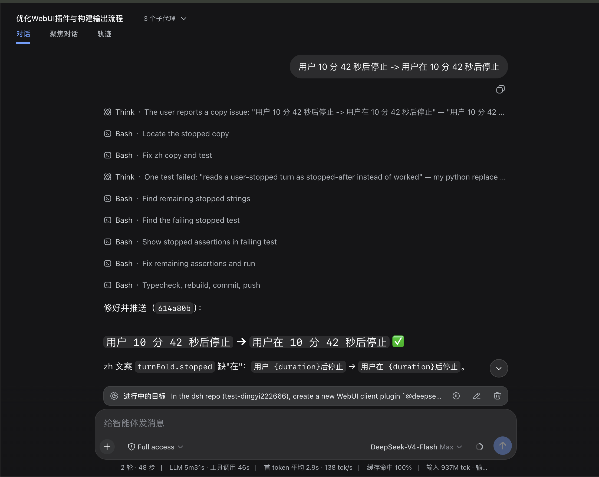
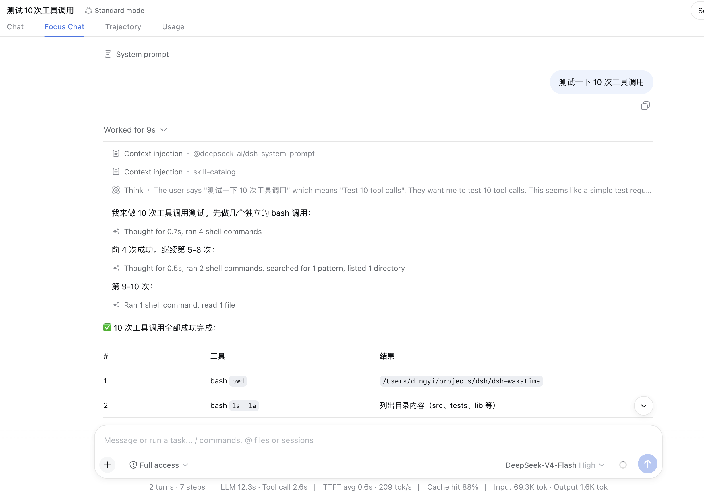
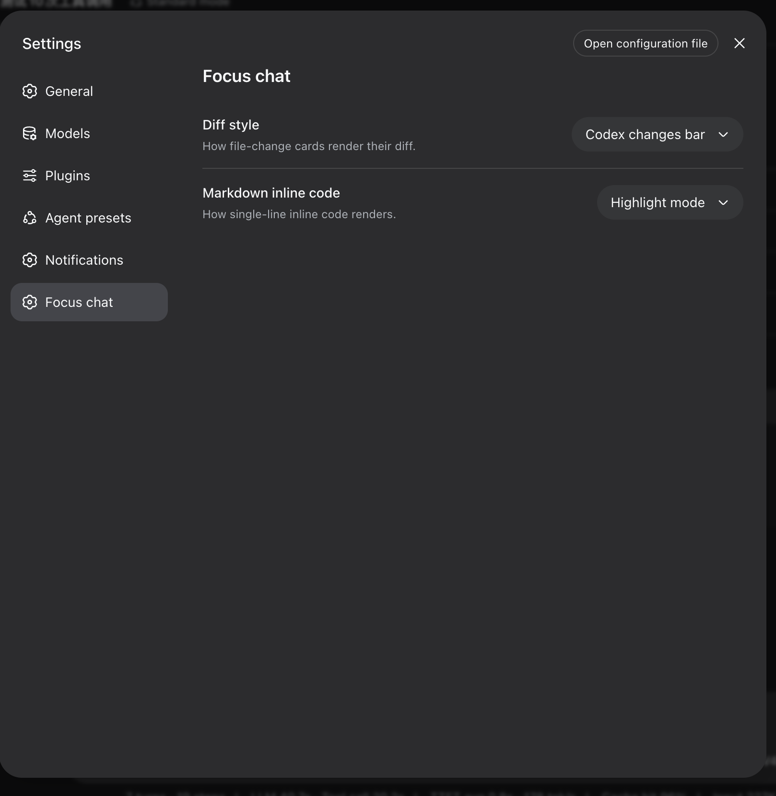

# dsh-focus-chat

[](https://www.npmjs.com/package/@dingyi222666/dsh-focus-chat)

[English](README.md) | 中文

一个给 dsh Web GUI 的插件，加了一个 **聚焦对话** 标签页——用 Claude Code 的方式精简地读对话。

## 截图

| 关闭——普通聊天视图 | 开启——聚焦对话视图 |
| --- | --- |
|  |  |
| 设置 |
|  |

不再一步步盯着过程，一个助手回合会收成一条摘要行：

> 思考了 36 秒，编辑了 8 次，读取了 17 个文件，列出了 18 个目录，运行了 2 个命令，载入了 3 项上下文

整回合还能再收成一条 `工作了 X 分 Y 秒` 行，点开即完整细节（工具卡片、思考、上下文、产物、复制/fork，与聊天行同款）；中途插话把折叠切段，被停止的回合读作 `用户 X 后停止`。**刷新后整段对话直接以折叠形态呈现**：窗口之外的每个回合由宿主端索引渲染为「用户消息 + 工作时长 + 真实结束回复」，过程细节只在展开该回合时按需取回；超长历史由"加载更早的回合"按页补折叠，索引不可用时静默退回窗口内折叠。

想看"刚才到底发生了什么"就切过来，想看完整过程就切回聊天视图。

## 安装

```sh
# 从 npm 安装（需要 dsh >= 0.1.0-rc.6）
dsh plugin --profile web add @dingyi222666/dsh-focus-chat
# 重启 dsh web，标签页自动挂载
dsh web
```

然后打开任意对话里的 聚焦对话 标签页。

说明：

- `dsh plugin` 相当于给 web profile 加一个依赖。bundle 型插件需要在 profile 的 `dsh.profile.bundles` 里出现它的完整包名才会被加载（新版本 dsh 会自动加；如果你的版本没加，请手动补上）；bundle patch 在下次启动时生效。
- 用仓库源码启动的 CLI 时，请直接调用 bin（`node --import tsx/esm apps/cli/src/bin.ts ...`）。

## 为什么要单独一个标签页？为什么不直接改聊天视图？

一句话：聊天视图的内部对第三方插件是封闭的——这是设计如此——而且这个插件刻意不碰 dsh 自己的源码。具体来说：

- **键控槽位是独占的，不是共享的。**聊天的行通过 `conversation.chat.node`、`tool.call.toolview`、`conversation.chat.turnTail` 这类槽位渲染。这些槽位由聊天入口自己声明，槽位系统在加载期拒绝重复声明——冲突本身就是设计在说话。插件既不能往聊天对话流里插自己的行，甚至连声明聊天自己的槽位都不行。
- **插件不能复用聊天的渲染代码。**跨 bundle 边界导入另一个插件包的值是被禁止的（bundle purity 门禁），所以没有任何办法借用聊天的组件——每一行都只能用共享原语和公开快照自己画。
- **唯一合法的插入点是 `conversation.view` 列表槽**——整个消息界面。这就是为什么插件自带一整个视图，而不是去改聊天视图的显示方式。

想让聊天视图本身换个行为，那是聊天包仓库内的改动——正是这个插件要避免的。

## 缺什么

聚焦对话是忠实的阅读界面，不是第二个聊天视图：

- **没有 Inspect / 详情面板深链。**聊天的 Inspect 入口依赖插件够不到的内部机制；工具卡片内容一样，只是没有"跳去详情"的按钮。
- **别的插件给聊天加的工具卡片扩展在这里不渲染。**聚焦视图用内置的卡片渲染。
- **折叠按连续工具轮次。**两段之间有任何可见内容（回复、命令、你的插话）就保持分开。
- **行内文件链接依赖可选的文件提及服务**——和聊天视图同一个开关。
- **远端折叠行有一些窗口内折叠没有的读法。**右侧的轮次导航条只列窗口内的回合；远端回合不渲染产物文件列表（ui-deliverables 的回合数据）、文件提及，且其结束回复不可 fork（分支只对窗口内回合可用）。回合内的反馈（点赞/点踩）不受影响。

## 开发

> 本构建面向 dsh v0.1.2-alpha.2 客户端界面，所有 `@deepseek-ai/*` 运行时依赖都从 npm registry 安装（见 `package.json`）。这些包发布的 `/client` 入口是 `window.__ModuleLoader__` 浏览器闭包，而 dsh 测试运行时是按源码树构建的，所以 `yarn test` 会把 `@deepseek-ai` 客户端界面解析到同一 0.1.2-alpha.2 的主线源码检出：`vitest.config.ts` 从该检出的 tsconfig 路径映射派生别名（`MAINLINE` 常量）——保持检出在 alpha.2 发布线上，其余全部走 npm 安装。

- `yarn run build` — 产出浏览器 bundle 和 Node 半边。
- `src/client/model/` — 纯逻辑（折叠、合并、行模型、远端回合切片投影）；`src/client/view/FocusView.tsx` — 视图；`src/host/` — 宿主半边的回合索引与 RPC 通道；`src/protocol.ts` — 双半共享的线协议。
- `yarn test` — 行为测试；`yarn run typecheck` — 类型门禁。
- `--dev` 的 `dsh web` 会自动热加载重建的 bundle——改完 `yarn run build` 一般就能看到效果。

## 模型体验

无。该视图是对已记录对话快照的纯客户端派生，这里没有任何内容进入模型请求。

#### KV Cache 影响

无；该包既不组装也不发送提供方请求。
